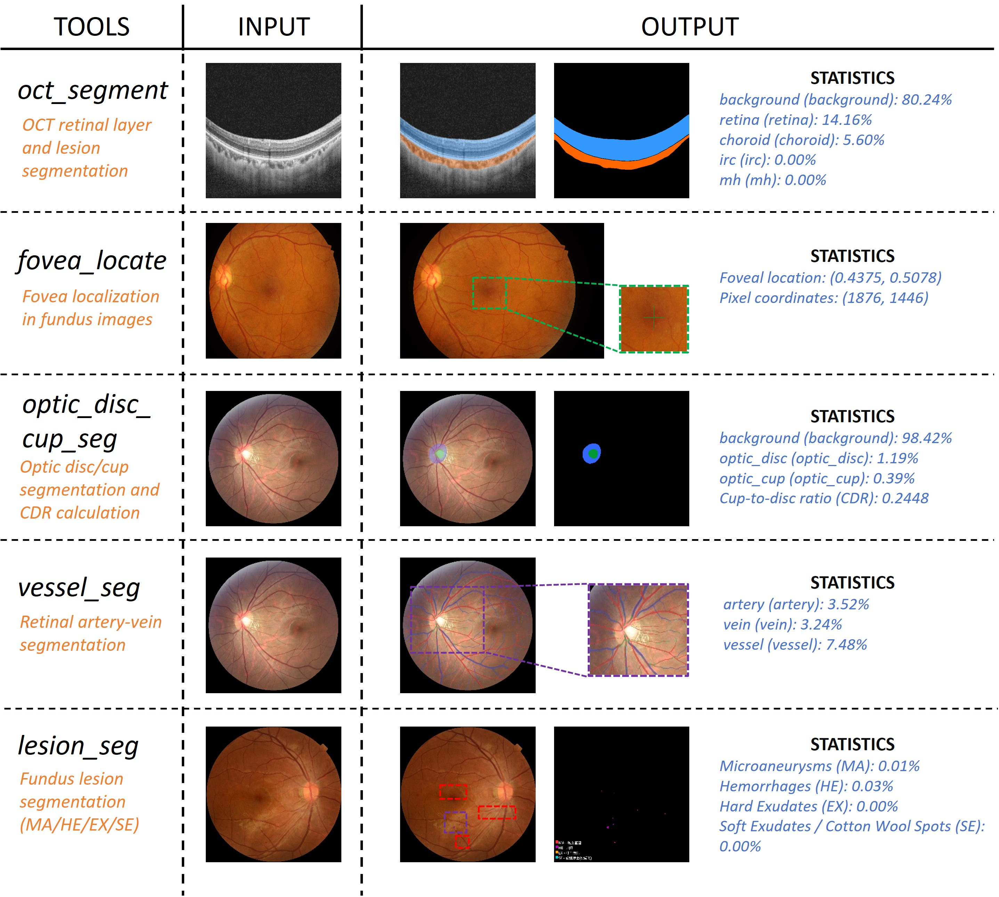

# 👁️ Eye MCP — 基于 Model Context Protocol 的眼底/OCT 图像分析工具集

[](https://www.python.org/)
[](https://modelcontextprotocol.io/)
[](https://pytorch.org/)
[](LICENSE)

提供 5 个 AI 推理工具，覆盖视网膜结构分割、病灶检测、血管分析等核心眼科影像任务，可直接对接 Claude Desktop 等 MCP 客户端使用。

> 🙌 本项目完全开源，欢迎任何形式的参与和贡献！无论是提 Issue、提交 PR、提出建议，还是在此基础上进行二次开发，都非常欢迎。希望能为眼科 AI 社区贡献一份力量。

## 📑 目录

- [🔧 Tools 一览](#-tools-一览)
- [✨ 功能介绍](#-功能介绍)
- [📁 项目结构](#-项目结构)
- [⚙️ 环境配置](#️-环境配置)
- [🚀 快速启动](#-快速启动)
- [💡 使用方式](#-使用方式)
- [🏋️ 模型权重](#️-模型权重)
- [🧪 开发与测试](#-开发与测试)
- [📄 License](#-license)
- [🗺️ 未来可优化方向](#️-未来可优化方向)
- [⚠️ 免责声明](#️-免责声明)

---

## 🔧 Tools 一览




---

## ✨ 功能介绍

| 工具 | 功能 | 模型 | 输出 |
|:-----|:-----|:-----|:-----|
| `oct_segment` | OCT 图像语义分割（视网膜/脉络膜/囊肿/黄斑裂孔） | UNet (smp) | mask + overlay + 统计 |
| `fovea_locate` | 眼底图像中央凹定位 | ResNet34 + 热力图回归 | 坐标 + 十字标记图 |
| `optic_disc_cup_seg` | 视盘/视杯分割，计算杯盘比(CDR) | SegFormer | mask + overlay + CDR |
| `vessel_seg` | 视网膜动静脉血管分割 | RIP-AV (PGNet) | overlay + 统计 |
| `lesion_seg` | 眼底 4 类病灶分割（MA/HE/EX/SE） | VNet2d ×4 | mask + overlay + 统计 |

---

## 📁 项目结构

```
eye-mcp/
├── src/eye_mcp/
│   ├── __init__.py              # 入口 main()
│   ├── server.py                # MCP 服务，注册 5 个工具
│   ├── config.yaml              # 全局配置
│   ├── common/                  # 公共模块（config, logger）
│   ├── models/                  # 模型定义
│   │   ├── oct_seg_unet.py
│   │   ├── fovea_location_net.py
│   │   ├── optic_disc_cup_seg.py
│   │   ├── lesion_seg_vnet2d.py
│   │   ├── vessel_seg_ripav.py
│   │   └── ripav/              # RIP-AV 子模块
│   └── services/                # 服务层（推理 + 可视化）
│       ├── oct_seg_service.py
│       ├── fovea_location_service.py
│       ├── optic_disc_cup_seg_service.py
│       ├── vessel_seg_service.py
│       └── lesion_seg_service.py
├── weights/                     # 模型权重（不随仓库分发）
├── tests/                       # 测试
├── client.py                    # 简易测试客户端
├── pyproject.toml
└── README.md
```

---

## ⚙️ 环境配置

### 1. 安装 uv（Python 包管理器）

如果还没装 [uv](https://docs.astral.sh/uv/)：

```bash
# Windows (PowerShell)
powershell -ExecutionPolicy ByPass -c "irm https://astral.sh/uv/install.ps1 | iex"

# macOS / Linux
curl -LsSf https://astral.sh/uv/install.sh | sh
```

安装后需将 `~/.local/bin`（Linux/macOS）或 `%USERPROFILE%\.local\bin`（Windows）加入 PATH。

### 2. 克隆仓库并安装依赖

```bash
git clone https://github.com/jimmybai666/eye-mcp.git
cd eye-mcp
uv sync
```

这会自动创建虚拟环境并安装所有依赖（PyTorch, Transformers, OpenCV 等）。

### 3. GPU 加速（可选）

默认安装 CPU 版 PyTorch。如有 NVIDIA GPU，可替换为 CUDA 版本以大幅加速推理：

```bash
uv pip install torch torchvision --index-url https://download.pytorch.org/whl/cu124 --reinstall
```

验证：

```bash
uv run python -c "import torch; print(torch.cuda.is_available())"  # True 即 GPU 可用
```

### 4. 放置模型权重

将权重文件放入 `weights/` 目录（详见下方 [模型权重](#-模型权重) 章节）。

部分模型（optic_disc_cup_seg, vessel_seg）支持首次运行时自动从 HuggingFace 下载。

---

## 🚀 快速启动

```bash
uv run eye-mcp
```

服务以 stdio 模式启动，等待 MCP 客户端连接。

---

## 💡 使用方式

### Claude Desktop

在 `%APPDATA%\Claude\claude_desktop_config.json` 中添加：

```json
{
  "mcpServers": {
    "eye-mcp": {
      "command": "uv",
      "args": ["--directory", "/path/to/eye-mcp", "run", "eye-mcp"]
    }
  }
}
```

### 简易客户端

```bash
uv run python client.py <tool_name> <image_path> [alpha]
```

示例：

```bash
uv run python client.py oct_segment tests/services/test_data/oct_seg/sample.png
uv run python client.py lesion_seg tests/services/test_data/lesion_seg/sample.jpg 0.7
```

输出保存在 `client_output/` 目录。

---

## 🏋️ 模型权重

权重文件不随仓库分发，从 HuggingFace 下载后放入 `weights/` 目录：

```bash
# 方式一：使用 HuggingFace CLI 一键下载
hf download baibaidelaobai/jimmybai666_eye-mcp-weights --local-dir weights/

# 方式二：手动下载
# 访问 https://huggingface.co/baibaidelaobai/jimmybai666_eye-mcp-weights 下载并解压到 weights/
```

下载后目录结构应为：

```
weights/
├── oct_seg.pth
├── fovea_location.pth
├── optic_disc_cup_seg/
│   ├── config.json
│   ├── model.safetensors
│   └── preprocessor_config.json
├── vessel_seg.pkl
└── lesion_seg/
    ├── MA.pth
    ├── HE.pth
    ├── EX.pth
    └── SE.pth
```

---

## 🧪 开发与测试

```bash
# 运行全部测试
uv run pytest tests/ -v

# 运行单个服务测试
uv run pytest tests/services/test_lesion_seg_service.py -v
```

在 `tests/services/test_data/<tool>/` 目录放入真实图片可触发端到端测试，结果保存在对应 `results/` 子目录。

---

## 📄 License

本项目基于 [MIT License](LICENSE) 开源。

本项目引用了以下开源模型，在此声明其来源与许可证：
- **optic_disc_cup_seg**: [pamixsun/segformer_for_optic_disc_cup_segmentation](https://huggingface.co/pamixsun/segformer_for_optic_disc_cup_segmentation) — Apache-2.0
- **vessel_seg**: [RIP-AV](https://github.com/weidai00/RIP-AV) — MIT

如有任何侵权问题，请通过 Issue 联系我们，确认后将立即删除相关内容。

---

## 🗺️ 未来可优化方向

- 提升分割精度：引入更大 backbone、数据增强、后处理优化
- 新增工具：糖尿病视网膜病变(DR)分级、青光眼风险评估、黄斑变性检测等
- Docker 部署：提供一键容器化方案

---

## ⚠️ 免责声明

- 本项目仅供学术研究和技术探索使用，**不可用于临床诊断或医疗决策**。
- 模型输出不构成任何医学建议，不能替代专业医生的判断。
- 使用者需自行承担因使用本工具产生的一切风险和责任。
- 本项目不保证模型预测结果的准确性、完整性或可靠性。
- 任何基于本项目输出做出的决策，作者不承担任何法律责任。

